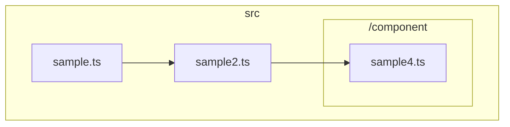

# TypeScript Graph

```bash
tsg --md dependencies.md
```


```mermaid
flowchart
    subgraph src["src"]
        src/sample2.ts["sample2.ts"]
        src/sample.ts["sample.ts"]
        subgraph src/component["/component"]
            src/component/sample4.ts["sample4.ts"]
        end
    end
    src/sample2.ts-->src/component/sample4.ts
    src/sample.ts-->src/sample2.ts
```
